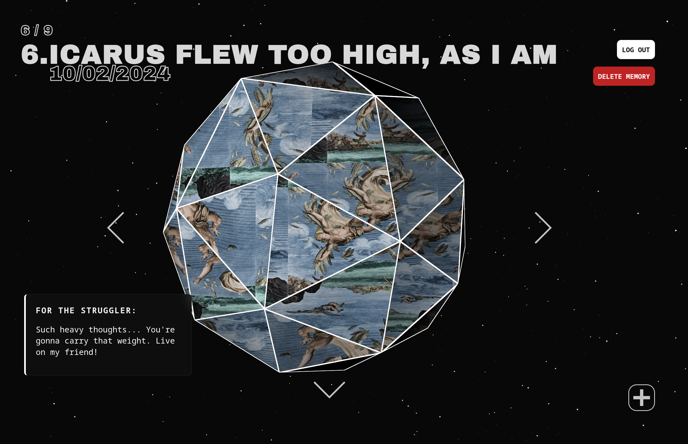

# 記憶のオーブ - Memory Orb

<p align="center">
<a href="https://memory-orb.vercel.app/"></p></a>
<p align="middle">
<i>記憶のオーブ, a beautiful showcase of nostalgia. </i>
</p>

<p align="center"><b>Memory Orb is a simple, yet mesmerizing, memory showcase for you to store precious moments in our fleeting life.</b></p>

## Inspiration

I have always been a person who gets nostalgic often. At gatherings with university friends, laughing and bantering, I'd remember the high school days when I was similarly excited and happy. But just as often, I'd get sad thinking about those days. Perhaps I didn't experience it fully? Or is it that I was trying too hard to fit in that I forgot about the "now"? It always felt like those moments went by so suddenly, one second you're having the time of your life, and the next you're reminiscing about it. I wonder, how can I capture these fleeting moments and tell a story with it? I want to be able to flip - similar to flipping pages in a book - through my memories like a story.

A quote in Spiritfarer really stuck with me when I played through it:

> "After the artist has been long gone, turned to dust, the art remains... And so it is that art alone is left in our wake. The only veritable form of transcendence to ever have been in our grasp." - Gustav

You have only truly lived, when the thoughts left behind for the living, are memories of you. I find it poetic that everything will truly wither and die out, even memories, yet we still try so desperately to cling onto them. Ironic, considering I am also desperately clinging onto my memories. But perhaps that is good, because a memory worth clinging onto, is a memory that deserves to be eternalize.

Thus, I decided to create **Memory Orb (or 記憶のオーブ)**, a beautiful showcase of *nostalgia*, and a way tell the story of your life, accompanied with mesmerizing visuals.

## What does it do?
In the simplest terms, users can upload images of any moment in their life and attach a story alongside it, so speak your mind, be free and appreciate every moment of your life.

With a bit more details, users can sign up or log in, then the server will fetch the data related to that user and display it on the cube.

## Installation
If you just want to use the website, you could just access [**Memory Orb - 記憶のオーブ**](...), make an account and use it normally. However, if you want to run locally for your own uses, here's what to do.

Before installing, make sure you have a database set up like this with the exact column names:

```bash
# "users" table
------------------------------------------------
| id | username | password_hash | creation_date|
------------------------------------------------

# "memory" table
-----------------------------------------------------------------------------------------
| id | memory_name | memory_date | memory_info | memory_img_url | user_id (foreign key) |
-----------------------------------------------------------------------------------------
```

Additionally, you need to set up a [**cloudinary**](https://cloudinary.com/) storage for our storage API. You would also need a Google API key, if you dont want to use AI tho, comment out line 65 in `MainIco.tsx`

Now get all your environment variables and store it in `.env` in folders with `.env.public`, copy the variable name exactly as shown in `.env.public`. You can generate a SECRET_KEY with `openssl rand -hex 32` on Linux.

I recommend installing [**docker**](https://www.docker.com/get-started/) and running `docker compose` so you won't need to be setting up the environments, installing the packages and be able to avoid any OS-related issues:

```bash
git clone ...
cd memory-orb
docker compose up [--build] # Run with --build if its the first time.
```

Alternatively, you could build everything from scratch:

```bash
# Clone repo
git clone ...

# Go into frontend and install npm packages
cd memory-orb/frontend && npm install && cd ..

# Create a virtual environment and activate it
python3 -m venv .venv && source .venv/bin/activate
# Install Python packages
cd backend && pip install -r requirements.txt && cd .. && cd frontend

# Start localhost @ port: 5173
npx vite
```

## Video Demo + General structures
<p align="center">
<a></a></p>
<p align="middle">
<i>Click on the image for the video!</i>
</p>

```bash
# The general structure
├── backend
│   ├── database.py
│   ├── Dockerfile
│   ├── main.py
│   ├── models.py
│   ├── requirements.txt
│   ├── schemas.py
│   └── storage.py
├── CONTRIBUTING.md
├── frontend
│   ├── Dockerfile
│   ├── public
│   └── src
│       ├── App.css
│       ├── App.tsx
│       ├── assets
│       │   └── react.svg
│       ├── components
│       │   ├── AddButton.tsx
│       │   ├── Arrows.tsx
│       │   ├── LoadingScreen.tsx
│       │   ├── Login.tsx
│       │   ├── Logo.tsx
│       │   ├── MainIco.tsx
│       │   ├── MemoryInfo.tsx
│       │   ├── MemoryName.tsx
│       │   ├── Stars.tsx
│       │   └── TitleCard.tsx
│       ├── index.css
│       ├── main.tsx
│       └── shaders
│           ├── fragmentLine.ts
│           ├── fragment.ts
│           ├── vertexLine.ts
│           └── vertex.ts
└── README.md
```

## Technologies used
- **Framework:** [FastAPI](https://fastapi.tiangolo.com/)
- **Cool 3D stuff:** [React-Three-Fiber](https://github.com/pmndrs/react-three-fiber)
- **Database:** PostgreSQL (I used [Heroku](https://www.heroku.com/), you could make a local postgres!)
- **AI:** [Gemini API](https://ai.google.dev/gemini-api/docs) - 2.5 Flash Lite
- **Docker:** I just like Docker
- **Object Storage:** Cloudinary

## Known issues
1. CSS: They do not work for different resolutions or anything other than desktops as far as I know.
2. Login, submit, delete buttons does not have indicators showing they are fetching data.

